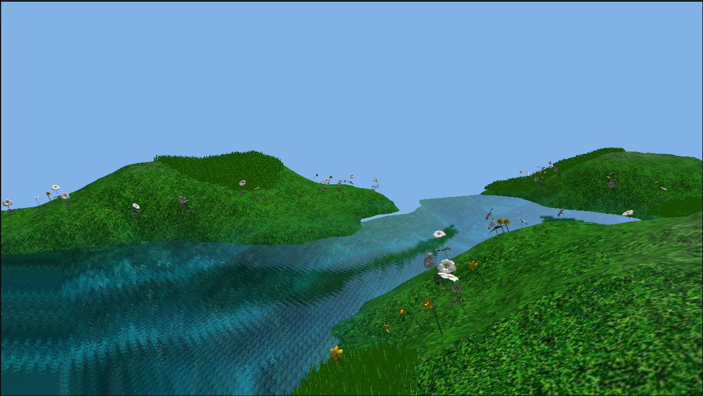

# Mundo Procedural com Água Realista

Este projeto é uma demo de renderização em **C++ + OpenGL** que mostra um mundo 3D gerado proceduralmente, com **água dinâmica**, **ciclo de dia/noite**, terreno com diferentes texturas e até vegetação espalhada pelo cenário.


---

## Foi criado:

* **Terreno Procedural** – gerado dinamicamente, com mistura de texturas (terra, grama, rocha) usando perlin noise.
* **Água Realista** – reflexão/refração em tempo real, distorções via normal map + DUDV.
* **Ciclo de Dia/Noite** – o sol se move, a luz e o céu mudam ao longo do tempo.
* **Vegetação** – instâncias de grama e flores distribuídas pelo terreno.
* **Câmera Cinemática** – caminho pré-definido usando Catmull-Rom spline para criar um "tour"".
* **Renderização Multi-Pass** – combina várias passagens (reflexão/refração/normal) para construir o efeito final da água.

---

## Screenshot



---

## Como rodar

### Dependências

No Linux (Debian/Ubuntu), você pode instalar o que precisa assim:

```bash
sudo apt-get update
sudo apt-get install build-essential libglfw3-dev libglm-dev libassimp-dev libgl1-mesa-dev
```

O projeto já inclui `glad` e `stb_image`.

### Compilação

Clone o repositório, vá até a raiz (`CG-project/`) e rode:

```bash
make
```

Isso vai gerar um binário chamado `apk`.

### Execução

```bash
./apk
```

### Controles

* **W, A, S, D** -> mover a câmera
* **Mouse** -> olhar em volta
* **Scroll do mouse** -> zoom
* **C** -> ativa/desativa câmera cinemática
* **ESC** -> fecha o programa

---

## Problemas que enfrentei

* no começo, `glfwTerminate()` era chamado antes de liberar shaders/modelos o que levava a um **segfault** na saída. Resolvido encapsulando tudo num escopo para garantir ordem certa.
*  precisei configurar FBOs, clipping planes e inverter a câmera. Erros visuais apareciam fácil.
* cada planta/grama sendo desenhada separadamente acabou com o FPS (embora parte do problema se deva a falta de potência do meu pc).
* a dificuldade em entender VBA, VAO e etc dessa nova versão.
* colocar texturas em objs, resolvido com std image.
---

##  Melhorias futuras

* **Instanced Rendering** para vegetação -> menos chamadas de draw, mais FPS.
* **Arquitetura do código** -> separar a lógica num `Renderer`, deixar `main.cpp` mais limpo.
* **Água mais bonita** -> ondas de Gerstner (precisaria de um pc mais potente antes disso), caustics no fundo.
* **Resource Manager** → evitar carregar a mesma textura/modelo várias vezes.
* **Interatividade** → colisão da câmera com terreno, ondulações na água quando algo encosta nela.

---

## Autor

Projeto desenvolvido individualmente.
Deivison da Silva Costa

